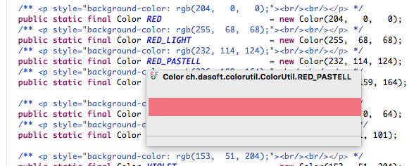

# ColorUtil
ColorUtil file for Java Project. Helps you organize your Colors.

## Color Library in one Place
* Thanks to the comments, you get the color as a preview when hovering over the name when using Eclipse.

## Functions for color manipulations:
* convertRgbToHex
* convertHexToColor
* isLight
* isDark
* lighter (Make Color lighter)
* darker (Make Color Darker)

Thanks to http://geosoft.no/software/colorutil/ColorUtil.java.html